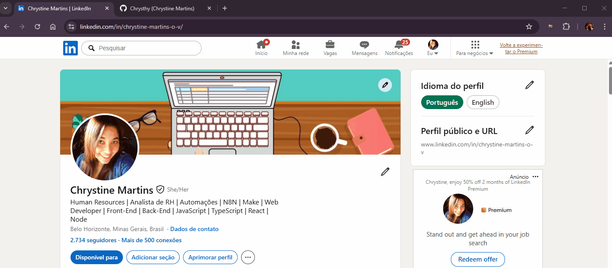

<h1 align="center">Quick Bookmarks – Chrome Extension 🔗</h1>

<p align="center">A simple Chrome extension to quickly save and manage useful links.<p>

<p align="center">
  <a href="#-live-demo">Live Demo</a>&nbsp;&nbsp;&nbsp;|&nbsp;&nbsp;&nbsp;
  <a href="#-screenshots">Screenshots</a>&nbsp;&nbsp;&nbsp;|&nbsp;&nbsp;&nbsp;
  <a href="#-technologies">Technologies</a>&nbsp;&nbsp;&nbsp;|&nbsp;&nbsp;&nbsp;
  <a href="#-features">Features</a>&nbsp;&nbsp;&nbsp;|&nbsp;&nbsp;&nbsp;
  <a href="#-how-to-run">How to Run</a>&nbsp;&nbsp;&nbsp;|&nbsp;&nbsp;&nbsp;
  <a href="#-license">License</a>&nbsp;&nbsp;&nbsp;|&nbsp;&nbsp;&nbsp;
  <a href="#-contributing">Contributing</a>&nbsp;&nbsp;&nbsp;|&nbsp;&nbsp;&nbsp;
  <a href="#support">Support</a>
</p>

<p align="center">
  
</p>

<br>

## 🌐 Live Demo

<p align="center">
  <a href="https://chrysthy.github.io/quick-bookmarks-extension/">
    
  </a>
</p>

<p align="center">
  <sub>Tip: Use right-click → “Open in new tab”.</sub>
</p>

<br>

## 📸 Screenshots

<p align="center">
  
</p>

<br>

## 🛠 Technologies

- HTML5  
- CSS3
- JavaScript (Vanilla)
- Chrome Extension API for browser features
- Local Storage for data persistence
- Git and GitHub

<br>

## ✨ Features

- **One-Click Tab Saving** - Instantly capture and save the current browser tab as a lead.
- **Manual Lead Entry** - Easily add new leads by pasting any URL.
- **Local Persistence** - All data is securely stored in the browser using local storage (no backend required).
- **Organized Lead Management** - Access all saved links in a clean, structured, and clickable list.
- **Quick Deletion (Double-Click)** - clear all stored data with a simple double-click action.
- **Lightweight & Fast** - Optimized for performance with a minimal and responsive UI.
- **Seamless Chrome Integration** – Accessible directly from the browser extension popup.


<br>

## ⚙ How to Run

Follow these steps to run the extension locally:

### Get the project

Clone the repository:

```bash
git clone https://github.com/Chrysthy/quick-leads-extension.git

Or download it as a ZIP:

1. Click on the green Code button
Select Download ZIP and extract the files on your computer

2. Open Chrome Extensions
Go to: chrome://extensions/
Enable Developer mode (top right corner)

3. Load the extension
Click on Load unpacked
Select the project folder

4. Start using
The extension will appear in your Chrome toolbar
Click the icon to open the popup and start saving bookmarks

###💡 Tip

If you make changes to the code:

Go back to chrome://extensions/
Click Reload on the extension


<br>

## 📜 License

* This project is licensed under the [MIT License](https://choosealicense.com/licenses/mit/)

<br>

## 🫱🏻‍🫲🏻 Contributing
<p> Contributions, issues, and feature requests are welcome! Please, feel free to do it! 😉 </p>

<br>

## 🌟 Support
<p> If you like this project, please give it a star ⭐ and share it with others! 😄 </p>
